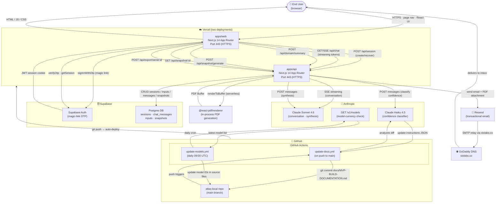

# Atlas Readiness Guide — System Architecture

> Generated: 2026-03-08. Reflects the current production MVP.

---

## High-Level Overview

Atlas is a **Next.js monorepo** deployed on **Vercel** with two separate applications:

| App | URL | Purpose |
|-----|-----|---------|
| `apps/web` | `atlas-readiness-guide.vercel.app` (web) | React UI — workspace, chat, report |
| `apps/api` | `atlas-api.vercel.app` (API) | Backend — AI, DB, email, PDF |

All data is persisted in **Supabase** (Postgres + Auth). External services are **Anthropic** (AI), **Resend** (transactional email), and **GoDaddy** (DNS/domain for `stxlabs.co`).

---

## System Architecture Diagram



---

## Component Breakdown

### Frontend — `apps/web`

| Layer | Key Files | Notes |
|-------|-----------|-------|
| Entry / Start | `app/start/page.tsx` | Email capture; creates or recovers session |
| Auth callback | `app/auth/callback/page.tsx` | Handles magic-link OTP redirect from Supabase |
| Workspace | `app/workspace/page.tsx` | Main assessment interface |
| Report | `app/snapshot/page.tsx` | Readiness report view |
| State | `lib/context/assessment-context.tsx` | `useReducer` — session, domains, topics, messages |
| Storage | `lib/storage.ts` | `localStorage` key constants |

Key components:

- `TopBar` — shows auth state (guest badge + sign-up CTA, or avatar + email)
- `WelcomeModal` / `SaveProgressPopup` — in-session sign-up flows
- `ChatPanel` — SSE streaming chat with AI
- `export-section` — triggers email send (no download button; PDF is email-only)
- `UnlockPreview` — gate overlay for unsigned-in users hitting the report

---

### Backend — `apps/api`

| Route | Method | Timeout | Purpose |
|-------|--------|---------|---------|
| `/api/session` | POST | 10s | Create new session (guest or auth) |
| `/api/session/[id]` | GET/PUT | 10s | Read or update session |
| `/api/session/[id]/claim` | POST | 10s | Migrate guest session to auth user |
| `/api/session/recover` | POST | 10s | Recover existing session by email |
| `/api/chat/init` | POST | 30s | Initialise conversation context |
| `/api/chat` | GET (SSE) | 60s | Streaming conversation with Claude Sonnet |
| `/api/domain/summary` | POST | 30s | Per-domain summary generation |
| `/api/snapshot/generate` | POST | 120s | Full report synthesis (Claude Sonnet) |
| `/api/snapshot/[sessionId]` | GET | 10s | Fetch saved snapshot |
| `/api/export/send/[sessionId]` | POST | 60s | Generate PDF + send email via Resend |
| `/api/export/pdf/[sessionId]` | GET | — | Legacy direct-download (broken; kept for reference) |
| `/api/health` | GET | — | Uptime check |

Vercel function timeouts are set in `apps/api/vercel.json`.

---

### AI Architecture

```
User message
    │
    ▼
/api/chat  (SSE)
    │
    ├─ lib/ai/agents/conversation.ts
    │      • tools: recordInput, transitionDomain
    │      • model: claude-sonnet-4-6
    │      • streams tokens back via SSE
    │
    └─ lib/ai/confidence/classifier.ts
           • model: claude-haiku-4-5-20251001
           • classifies confidence level per input
             (HIGH / MEDIUM / LOW / INSUFFICIENT)

/api/snapshot/generate  (POST)
    │
    └─ lib/ai/prompts/synthesis-v3.ts
           • model: claude-sonnet-4-6
           • single-pass synthesis of all inputs
           • returns SnapshotV3 JSON:
               expansion_positioning, overall_score,
               domains[], strengths[], risks[],
               critical_actions[], validation_actions[],
               early_signals[], roadmap_phase1/2/3[]
```

---

### Database Schema (Supabase Postgres)

```
sessions
  id              UUID PK
  email           TEXT
  user_id         UUID (FK → auth.users, nullable for guests)
  is_guest        BOOLEAN
  created_at      TIMESTAMPTZ
  last_active     TIMESTAMPTZ
  expires_at      TIMESTAMPTZ (24h for guests)
  snapshot        JSONB  (cached SnapshotV3)

chat_messages
  id              UUID PK
  session_id      UUID FK → sessions
  role            TEXT  (user | assistant | tool)
  content         TEXT
  created_at      TIMESTAMPTZ

inputs
  id              UUID PK
  session_id      UUID FK → sessions
  domain          TEXT
  topic           TEXT
  value           TEXT
  confidence      TEXT  (HIGH | MEDIUM | LOW | INSUFFICIENT)
  created_at      TIMESTAMPTZ

snapshots
  id              UUID PK
  session_id      UUID FK → sessions
  data            JSONB  (SnapshotV3)
  created_at      TIMESTAMPTZ
```

Row-level security is enforced by Supabase via the `user_id` column. Guest sessions use `is_guest = true` and are purged after 24 hours (enforced at the application layer; a Supabase scheduled function or cron should be added to automate purge — flagged as future work).

---

### Email + PDF Flow

```
User clicks "Email Report"
    │
    ▼
POST /api/export/send/:sessionId
    │
    ├── Fetch snapshot from DB
    ├── renderToBuffer(SnapshotDocument)  ← @react-pdf/renderer (in-process)
    │       (serverComponentsExternalPackages — not bundled by webpack)
    │
    ├── Resend.emails.send({
    │     from: reports@stxlabs.co,
    │     to: user email,
    │     reply_to: hello@stxlabs.co,
    │     subject: "Your Atlas Readiness Report",
    │     html: snapshot-email.ts template,
    │     attachments: [{ filename, content: pdfBuffer }]
    │   })
    │
    └── Resend → GoDaddy DNS (MX/SPF/DKIM for stxlabs.co) → User inbox
```

The email template (`lib/email/templates/snapshot-email.ts`) includes:
- Atlas compass logo (base64 SVG data URI — works in Apple Mail / Outlook; degrades to dark square in Gmail)
- Expansion positioning badge with colour-coded label
- V3 coverage section: per-domain dot indicators, confidence badges, overall progress bar
- 90-day roadmap summary
- STX Labs service pitch + discovery call CTA

---

### Automation Agents

| Agent | Trigger | What it does |
|-------|---------|--------------|
| **MVP Docs Updater** | Push to `main` | Analyses git diff with Claude Haiku; rewrites `docs/MVP-BUILD-DOCUMENTATION.md`; commits `[skip ci]` |
| **Claude Context Agent** | Local post-commit hook | Scans project; regenerates CLAUDE.md auto-sections; amends commit |
| **Model Currency Agent** | Daily 09:00 UTC | Fetches `/v1/models` from Anthropic; updates stale model IDs in source; commits `[skip ci]` to `main` |

See `AGENTS.md` for full details on each agent.

---

### Environment Variables

**`apps/api/.env.local`**

| Variable | Service | Used for |
|----------|---------|---------|
| `ANTHROPIC_API_KEY` | Anthropic | All Claude API calls |
| `SUPABASE_URL` | Supabase | DB + Auth REST endpoint |
| `SUPABASE_SERVICE_ROLE_KEY` | Supabase | Server-side DB access (bypasses RLS) |
| `RESEND_API_KEY` | Resend | Transactional email |
| `NEXT_PUBLIC_API_URL` | Internal | Web → API base URL |

**`apps/web/.env.local`**

| Variable | Service | Used for |
|----------|---------|---------|
| `NEXT_PUBLIC_SUPABASE_URL` | Supabase | Client-side auth |
| `NEXT_PUBLIC_SUPABASE_ANON_KEY` | Supabase | Client-side auth (public) |
| `NEXT_PUBLIC_API_URL` | Internal | Points to `apps/api` |

GitHub Actions also require `ANTHROPIC_API_KEY` as a repository secret for the docs and model-currency workflows.

---

### Auth Flow

```
New user arrives at /start
    │
    ├─ [Sign In] → Enter email → Supabase sendMagicLink
    │                │
    │                └── Email arrives → click link → /auth/callback
    │                        │
    │                        └── verifyOtp → JWT stored in cookie
    │                                │
    │                                └── POST /api/session/recover (links session to user_id)
    │
    └─ [Continue as Guest] → POST /api/session { is_guest: true }
                                │
                                └── Guest badge shown in TopBar
                                        │
                                        └── Clicks report → gate overlay
                                                │
                                                └── Signs up in-session (SaveProgressPopup)
                                                        │
                                                        └── POST /api/session/:id/claim
                                                                (migrates session to user)
```

---

### Deployment Pipeline

```
Developer pushes to main
    │
    ├── Vercel
    │     ├── Builds apps/web → deploys web frontend
    │     └── Builds apps/api → deploys API serverless functions
    │
    └── GitHub Actions
          ├── update-docs.yml: analyses diff, updates MVP docs
          └── (daily) update-models.yml: keeps model IDs current
```

---

*This document was generated from a live codebase audit. Update it when significant architectural changes are made.*
